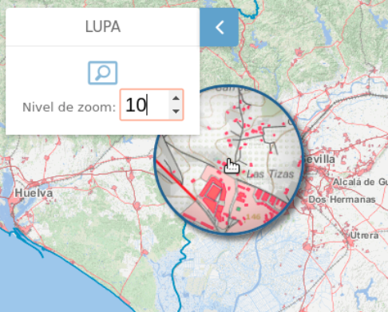

# M.plugin.Magnify

Plugin que permite realizar un efecto de zoom o de lupa sobre una o varias capas



# Dependencias

- magnify.ol.min.js
- magnify.ol.min.css


```html
 <link href="../../plugins/magnify/magnify.ol.min.css" rel="stylesheet" />
 <script type="text/javascript" src="../../plugins/magnify/magnify.ol.min.js"></script>
```

# Parámetros

- El constructor se inicializa con un JSON de options con los siguientes atributos:

- **layers**. String que contiene el nombre de las capas que se quieren seleccionar del mapa. A estas capas se les aplicará el filtro de lupa. Si este campo está vacío, el efecto lupa se aplicará a todas las capas.

- **position**. Indica la posición donde se mostrará el plugin.
  - 'TL':top left
  - 'TR':top right (default)
  - 'BL':bottom left
  - 'BR':bottom right

- **zoom**. campo numérico que define el zoom inicial. (Valor por defecto 1)

- **zoomMax**. campo numérico que define el nivel maximo de zoom. (Valor por defecto 10)

# Eventos

# Otros métodos

# Ejemplos de uso

## Ejemplo 1
```javascript
const map = M.map({
  container: 'map'
});

const mp = new M.plugin.Magnify({
  layers: '',
  postition: 'TL',
});

map.addPlugin(mp);
```

## Ejemplo 2
```javascript
const map = M.map({
  container: 'map'
});

const mp = new M.plugin.Magnify({
  layers: 'provincias,fondo,Sevilla',
  zoom: 3,
  zoomMax: 20
});

map.addPlugin(mp);
```

## Ejemplo 3
```javascript
const map = M.map({
  container: 'map'
});

const mp = new M.plugin.Magnify({});

map.addPlugin(mp);
```
